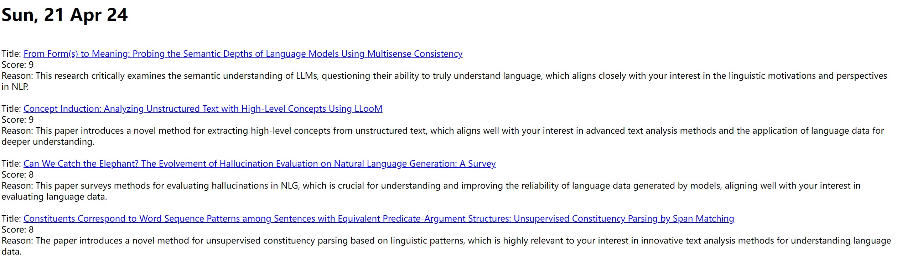

# LLMArXivDigest-lite

This repo aims to provide an updated and lightweight version of [AutoLLM/ArxivDigest](https://github.com/AutoLLM/ArxivDigest). 

## Basic Information

The original ArxivDigest service might have not been maintained for a while, and its UI/Huggingface page also doesn't seem to respond. I like the general idea of LLM-based personalized Arxiv digests, and I haven't been able to find a minimalist yet effective tool in this direction that is still in service. (You should check out the famous [Arxiv-sanity](https://arxiv-sanity-lite.com/) first! It was a bit different than what I need, but it might be helpful for you.) Therefore, this repo is created, based on the original code, to serve the purpose of generating personalized daily digest.

The repo attempts to be an up-to-date version that keeps the core functionality of interacting with the OpenAI API (as some of the original OpenAI calling code was deprecated). Meanwhile, the code has been largely simplified so that it can be more easily adapted for different usages. Please note that, since this was for personal use and I only needed a local output in my workflow, this repo is **only for generating the local digest.html file**, while other client-facing modules -- interacting via a UI, Github Workflow, or sending email via SendGrid -- has been removed. Please see [the original repo](https://github.com/AutoLLM/ArxivDigest) and ["Creating your own workflow"](#creating-your-own-workflow) below. Please also note that this would consume OpenAI credit (apprently); see details in ["Cost Estimation"](#cost-estimation).

There are also various minor improvements and simplifications, e.g.,
- the prompt has been rewritten to be much more fine-grained and includes In-Context Learning
- the script no longer caches the collection of new articles in a whole field locally
- the papers that are not chosen as relevant will be appended in the digest instead of ignored
- ...


## Usage

### Functionality
The code will produce a file "digest.html" in place. Like the original repo, the output file sorts the papers from your designated subjects/areas based on their relevance score (1-10) given by an LLM. For papers with a score >= 6, the LLM will also generate a short description of why and how it is relevant to your research interests.

The (first few lines of the) output file generally looks something like this:


### Setup for the first time

#### Basics: file your own field, interests, and examples
- Set `topic` and `categories` in config.yaml as your interested areas.
- List your research interests in the corresponding place in src/relevancy_prompt.txt:
> You are an excellent assistant with great expertise in [FILL IN YOUR OWN INFO (FIELDS)].
> 
> ...
> 
> My research interests center on \[FILL IN YOUR OWN INFO\]. Specifically:
> 1. \[FILL IN YOUR OWN INFO\]
> 
> Conversely, I am especially NOT interested in the following domains, and please, don't give a high score for these (unless they have something heavily related to my interests above):
> 1. \[FILL IN YOUR OWN INFO\]
> ...
- Setup the in-context examples with your own choice
> Below is an example input:
> 
> \#\#\#
>
> Title: \[FILL IN YOUR OWN INFO\]
>
> Abstract: \[FILL IN YOUR OWN INFO\]
>
> \#\#\#
>
> Title: \[FILL IN YOUR OWN INFO\]
>
> Abstract: \[FILL IN YOUR OWN INFO\]
>
> ...
>
> And below is a corresponding output for reference. Here, the "reasons" for papers that are not of interest (score<6) is also given just to give you more information and help you understand the criteria. Please remember that in your output, you DON'T need to generate "reasons" for the not-of-interest papers. Other than that, your output should follow the same format as the example.
>
> {"title": \[FILL IN YOUR OWN INFO\], "score": \[FILL IN YOUR OWN INFO\], "reason":  \[FILL IN YOUR OWN INFO\]}
> ...
>
> {"title": \[FILL IN YOUR OWN INFO\], "score": \[FILL IN YOUR OWN INFO\], "reason":  \[FILL IN YOUR OWN INFO\]}
> ...
  - *(recommended option)* Fill in some representative papers (both relevant and irrelevant to your interests), and provide your own scores and reasons for these papers. To better facilitate the model's reasoning, please also add the reasons for negative ("not chosen") examples, though they will not be generated in the actual run. Unless your interest is extremely niched, 4 instances (2 positive + 2 negative) should be sufficient and 6(3+3) would be overkilling. The output format might look like this:
  > {"title": "Mapping the Increasing Use of LLMs in Scientific Papers", "score": 8, "reason": "This work proposes an interesting text-based method to analyze how much of the academic text might be edited by LLMs. Though the context is largely grounded in scientific publishing, the methods might be of interest to you and can potentially be applied to other language data as well."}
  - *(not recommended, use only when you're really tight on OpenAI budget)* Remove the quoted part from relevancy_prompt.txt. Note that the performance and scales of score might not meet expectations in this case without in-context examples.

#### Other settings

The following parameters are not included in config.yaml because it's recommended not to change them. Nonetheless, you can customize these if you want to.

- **The scale of scores _(default: 1-10)_ and the threshold for selecting as relevant _(default: >= 6)_.** This is weaved in relevancy_prompt.txt and you can read through the prompt if you'd like to edit it. Yet, it is highly NOT recommended to do so because
  - the 1-10 scale provides a decent space for evaluation with [relatively not-so-inflated scores](https://citeseerx.ist.psu.edu/document?repid=rep1&type=pdf&doi=b75b5ccdb2db7ddd8c62e74633b6ef34345cef5a). It also has no "midpoint/borderline" so that the rater would be forced to pick one side, where threshold=6 corresponds to this choice of the higher half.
  - More importantly, **it would be much more effective to calibrate the score distribution via the in-context examples than setting a different threshold**. For instance, if your instances have scores of "7, 7, 1, 1", the system would probably be much more consevative compared with scores of "10, 10, 5, 5".
- **Batch size for a single request _(default: 8)_.** This determines how many papers are packed together in a single API request. You can change this in function `generate_body()` (when calling `generate_relevance_score()`) in action.py at Line 245. Again, this is not recommended. Having too small a batch would burn your cash quickly, since each request would need to start with the instructions (relevantcy_prompt.txt) and smaller batch size means more requests. It is also risky to have it greater than 10 since [performance may become worse](https://arxiv.org/pdf/2307.03172.pdf).
- **Other OpenAI API parameters, e.g. temperature _(default=0.1)_.** You can similarly specify those in `generate_relevance_score()`. Please note that it is highly recommended to use the GPT-4 series _(default model: 'gpt-4-turbo')_ and not anything before that (e.g. GPT-3.5), since the earlier versions are significantly more limited in instruction-follwing and reasoning (see [OpenAI's post](https://openai.com/gpt-4)).

### Running the script
Simply run
```
python src/action.py
```
in the repo directory. It will generate the output file "digest.html" in the repo.

### Cost Estimation
With gpt-4-turbo, a daily run on a field like _Computation and Language_ (\~50 papers/day?) would cost about 20-30 cents per day, or a few bucks per month. Though this is generally affordable, please note that the cost can escalate quickly if you add lots of fields and/or use more expensive models like GPT-4.

## Creating your own workflow

There are various ways to merge the local file into the daily workflow. I use [the Task Scheduler in Windows](https://en.wikipedia.org/wiki/Windows_Task_Scheduler) to automatically run the script at a certain time each day and present the html file. For uses in a lab, it makes sense to schedule one daily run on the server and send it to group members. You can also create your own email sender, e.g., using `smtplib`. [The original ArxivDigest repo](https://github.com/AutoLLM/ArxivDigest) has a tutorial on setting up emails via SendGrid if you prefer it (you might need to add things in action.py).
